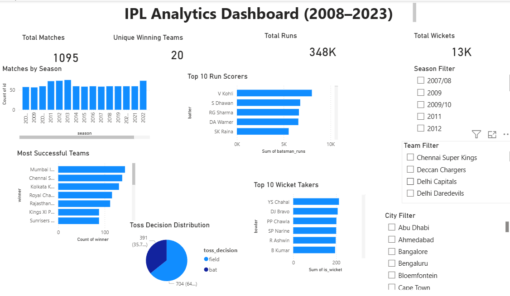

# 🏏 IPL Analytics Dashboard (2008–2023)

<p align="center">
  
  
  
  
  
</p>

---

# 📌 Project Overview

This project presents an **end-to-end IPL Data Analytics solution** built using **Python**, **MySQL**, and **Power BI**.

The project analyzes IPL matches from **2008–2023**, performs Exploratory Data Analysis (EDA), executes SQL business queries, generates reports, and visualizes insights through an interactive Power BI dashboard.

---

# 🎯 Objectives

- Analyze IPL match data
- Perform player performance analysis
- Analyze team performance
- Study batting and bowling statistics
- Generate business insights using SQL
- Build an interactive Power BI dashboard

---

# 🛠 Tech Stack

| Technology | Usage |
|------------|-------|
| Python | Data Analysis |
| Pandas | Data Cleaning |
| NumPy | Numerical Computing |
| Matplotlib | Visualization |
| Seaborn | Statistical Charts |
| MySQL | SQL Analysis |
| Power BI | Dashboard |
| Git | Version Control |
| GitHub | Project Hosting |

---

# 📂 Folder Structure

```text
IPL-EDA-Project
│
├── analysis/
├── data/
├── reports/
├── sql/
├── screenshots/
├── powerbi/
├── eda.py
├── requirements.txt
├── README.md
└── LICENSE
```

---

# 📊 Dashboard Features

- ✅ Total Matches
- ✅ Total Runs
- ✅ Total Wickets
- ✅ Unique Winning Teams
- ✅ Matches by Season
- ✅ Top 10 Run Scorers
- ✅ Top 10 Wicket Takers
- ✅ Most Successful Teams
- ✅ Toss Decision Distribution
- ✅ Interactive Filters

---

# 🖼 Dashboard Preview

> **Place your dashboard image inside the `screenshots` folder and name it `dashboard.png`.**

<p align="center">

</p>

---

# 📈 Key Insights

- 🏆 Mumbai Indians are among the most successful IPL franchises.
- 🏏 Virat Kohli ranks among the highest run scorers.
- 🎯 Top bowlers consistently dominate wicket charts.
- 🪙 Toss decisions influence match strategy.
- 🏟 Venue conditions impact match outcomes.
- 📅 Match counts vary across IPL seasons.

---

# 📄 Reports Generated

The project exports the following reports:

- Batting Summary
- Bowling Summary
- Boundary Summary
- Player Summary
- Team Summary
- Season Summary
- Toss Summary
- Venue Summary

---

# 🗄 SQL Concepts Used

- SELECT
- WHERE
- GROUP BY
- HAVING
- ORDER BY
- Aggregate Functions
- JOIN
- Subqueries
- CASE Statements
- Window Functions
- Common Table Expressions (CTE)

---

# 🚀 Installation

Clone the repository

```bash
git clone https://github.com/janvichauhan1639-source/IPL-EDA-Project.git
```

Move into the project directory

```bash
cd IPL-EDA-Project
```

Install dependencies

```bash
pip install -r requirements.txt
```

Run the project

```bash
python eda.py
```

---

# 📊 Power BI Dashboard

Open:

```text
powerbi/IPL_Analytics_Dashboard.pbix
```

---

# 🔮 Future Improvements

- Live IPL API Integration
- Streamlit Dashboard
- Match Winner Prediction
- Player Comparison Dashboard
- Advanced Interactive Analytics

---

# 👩‍💻 Author

**Janvi Chauhan**

🔗 GitHub: https://github.com/janvichauhan1639-source

---

# ⭐ Support

If you found this project useful, consider giving it a ⭐ on GitHub.